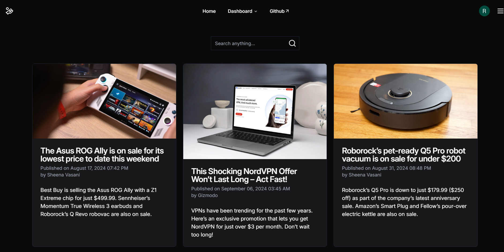
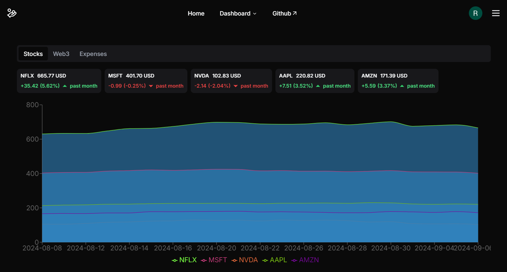
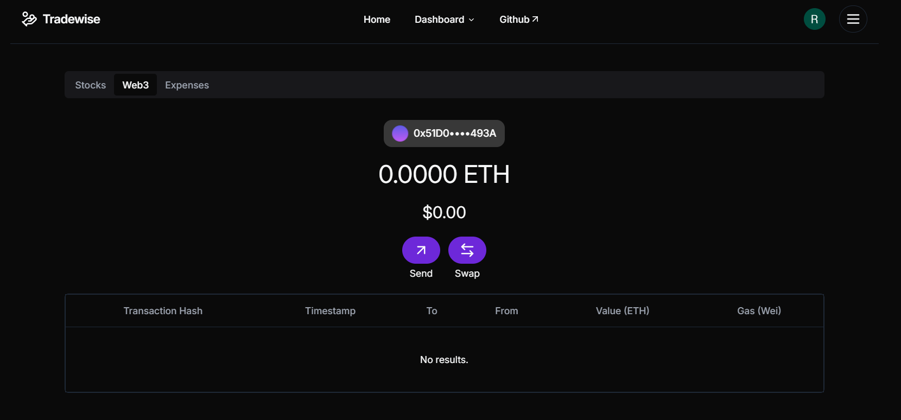
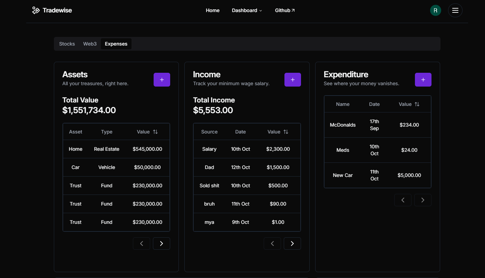
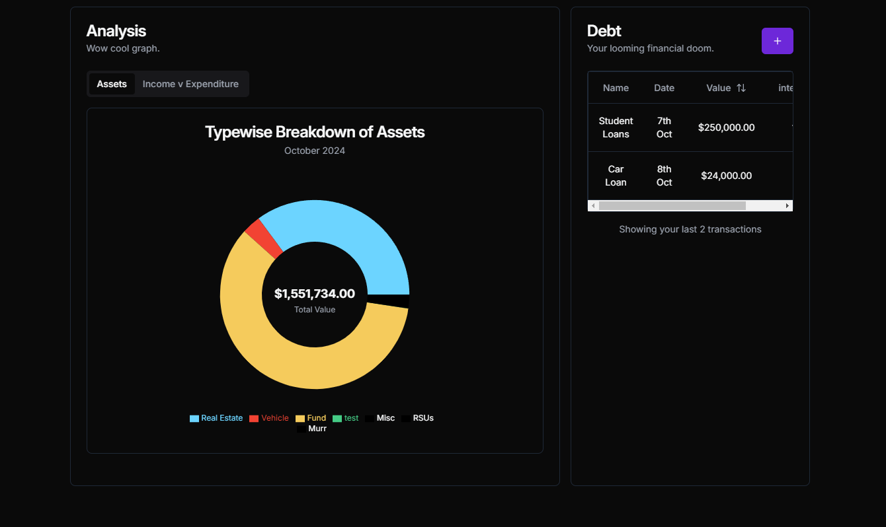

# Tradewise

- Index
  - [Tech stack](#tech-stack)
  - [Run locally](#run-locally)
  - [System Architecture](#system-architecture)
    - [C4 Model](#c4-model)
  - [Screenshots](#screenshots)

### Tech stack

- Frontend
  - React
  - Redux
  - Tailwind
  - Wagmi
  - ConnectKit
- Backend
  - Node.js
  - Express
  - Prisma
  - 1inch Aggregator API
- Database
  - PostgreSQL
- Build tool
  - Vite

### Run locally

- Clone this repo
  ```
  git clone https://github.com/rahulsm20/tradewise
  ```
- Setup client
  - cd into folder
    ```
      cd client
    ```
  - Install packages
    ```
      npm install
    ```
  - Run client
    ```
      npm run dev
    ```
- Setup server
  - cd into server
    ```
      cd server
    ```
  - Install packages
    ```
    npm install
    ```
  - Run server
    ```
    npm run dev
    ```
    You can also run the server using docker
  - ```
    docker build -t <image_name> .
    ```
  - ```
    docker run -p 3000:3000 <image_name>
    ```

### System Architecture

#### C4 Model


### Screenshots










